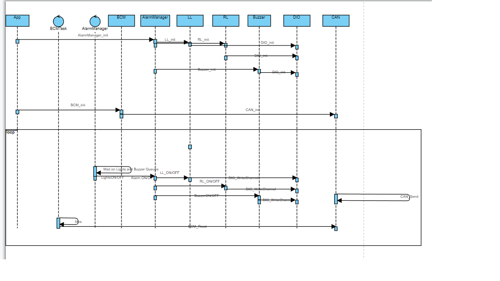

## Automotive Door Control System Design
Design of Automoive door control system

# Project overview
1. ECU 1 will send status messages periodically to ECU 2 through the CAN protocol
2. Status messages will be sent using Basic Communication Module (BCM)
3. Door state message will be sent every 10ms to ECU 2
4. Light switch state message will be sent every 20ms to ECU 2
5. Speed state message will be sent every 5ms to ECU 2
6. Each ECU will have an OS and application SW components
7. If the door is opened while the car is moving → Buzzer ON, Lights OFF
8. If the door is opened while the car is stopped → Buzzer OFF, Lights ON
9. If the door is closed while the lights were ON → Lights are OFF after 3 seconds
10. If the car is moving and the light switch is pressed → Buzzer OFF, Lights ON
11. If the car is stopped and the light switch is pressed → Buzzer ON, Lights ON

# Project Hardware
- Two microcontrollers connected via CAN bus
- One Door sensor (D)
- One Light switch (L)
- One Speed sensor (S)
- ECU 1 connected to D, S, and L, all input devices
- Two lights, right (RL) and left (LL)
- One buzzer (B)
- ECU 2 connected to RL, LL, and B, all output devices

this is the **Block Diagram** of the system

# Static Design
ECU1 layered archiecutre

ECU2 layered archiecutre

# Dynamic Design
ECU1 Sequence Diagram

ECU2 Sequence Diagram

